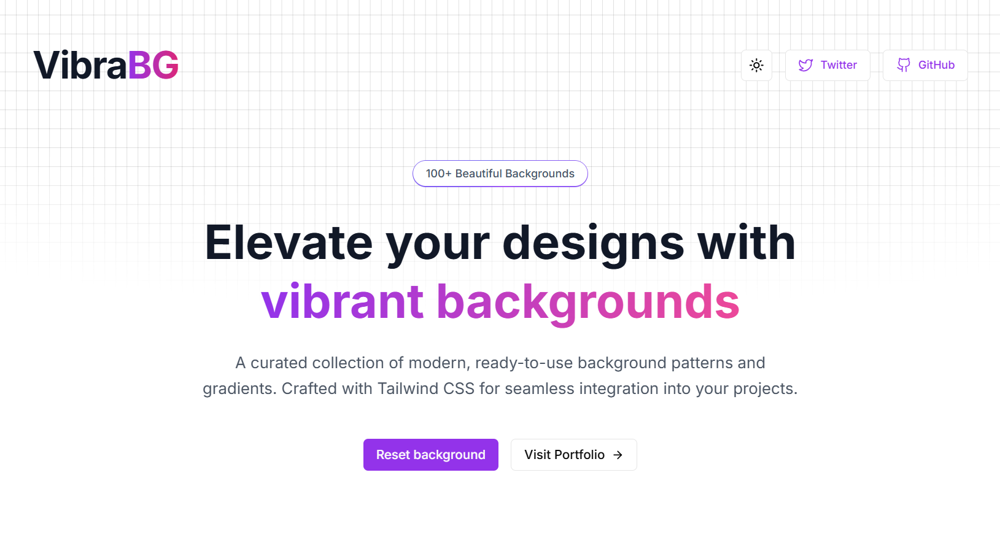

# 🎨 VibraBG - Premium Background Pattern Collection

> **A stunning, modern web application showcasing 100+ beautiful background patterns and gradients. Perfect for developers, designers, and agencies looking for a professional background showcase solution.**

[](https://vibrabg.vercel.app/)
[](#-pricing--licenses)
[](#-contact--support)

---

## 🌟 **What is VibraBG?**

VibraBG is a premium, fully-responsive web application that showcases a curated collection of modern background patterns and gradients. Built with Next.js 13+ and Tailwind CSS, it features a sleek interface with dark/light theme support, advanced filtering, and copy-to-clipboard functionality.

Perfect for:
- **Web Developers** looking for ready-to-use background snippets
- **Design Agencies** wanting to showcase background collections
- **SaaS Companies** needing a modern pattern library
- **Freelancers** building design resource websites

---

## ✨ **Key Features**

### 🎯 **Core Functionality**
- ✅ **100+ Premium Backgrounds** - Curated collection of modern patterns & gradients
- ✅ **Live Preview System** - Full-screen background testing
- ✅ **One-Click Copy** - Instant code copying with toast notifications
- ✅ **Advanced Search & Filter** - Find patterns by type (Grid, Gradient, All)
- ✅ **Theme Toggle** - Seamless dark/light mode switching
- ✅ **Responsive Design** - Perfect on all devices (Mobile, Tablet, Desktop)

### 🚀 **Technical Excellence**
- ✅ **Next.js 13+ App Router** - Latest React framework with server components
- ✅ **TypeScript** - Full type safety and better developer experience
- ✅ **Tailwind CSS** - Utility-first styling with custom design system
- ✅ **Radix UI Components** - Accessible, unstyled UI primitives
- ✅ **SEO Optimized** - Meta tags, Open Graph, Twitter Cards
- ✅ **Performance Optimized** - Fast loading, optimized images, lazy loading

### 🎨 **Design & UX**
- ✅ **Modern UI/UX** - Clean, professional interface design
- ✅ **Smooth Animations** - Micro-interactions and hover effects
- ✅ **Accessibility** - WCAG compliant, keyboard navigation
- ✅ **Custom Branding** - Easy to customize colors, fonts, and content

---

## 📦 **What You'll Get After Purchase**

### 📁 **Complete Source Code**
```
vibrabg-premium/
├── 📂 app/
│   ├── 📂 components/
│   │   ├── background.tsx          # 100+ background components
│   │   ├── playground.tsx          # Preview system
│   │   ├── search-filter.tsx       # Search & filter logic
│   │   └── ...
│   ├── globals.css                 # Global styles & CSS variables
│   ├── layout.tsx                  # Root layout with metadata
│   ├── page.tsx                    # Main homepage
│   └── providers.tsx               # Theme & context providers
├── 📂 components/
│   ├── 📂 ui/                      # Reusable UI components
│   └── theme-toggle.tsx            # Dark/light mode toggle
├── 📂 lib/
│   └── utils.ts                    # Utility functions
├── 📂 public/
│   ├── banner.jpg                  # Social media images
│   ├── cover.webp                  # Hero section image
│   └── ...
├── 📄 package.json                 # Dependencies & scripts
├── 📄 tailwind.config.js           # Tailwind configuration
├── 📄 tsconfig.json                # TypeScript configuration
├── 📄 next.config.js               # Next.js configuration
└── 📄 README.md                    # Setup & deployment guide
```

### 📚 **Documentation & Extras**
- ✅ **Setup Guide** - Step-by-step installation instructions
- ✅ **Customization Guide** - How to add your own backgrounds & branding
- ✅ **Deployment Guide** - Deploy to Vercel, Netlify, or any hosting
- ✅ **Component Documentation** - Detailed component API reference
- ✅ **Figma Design File** - Original design mockups (Premium+ only)
- ✅ **Lifetime Updates** - Free updates for 1 year

---

## 💰 **Pricing & Licenses**

<table>
<tr>
<th width="25%">🏷️ <strong>Starter</strong></th>
<th width="25%">🚀 <strong>Professional</strong></th>
<th width="25%">💎 <strong>Premium</strong></th>
<th width="25%">🏢 <strong>Enterprise</strong></th>
</tr>
<tr>
<td>

**$29**
<br><small>Perfect for personal projects</small>

**✅ Includes:**
- Complete source code
- Setup documentation
- 1 website license
- 6 months updates
- Email support

**❌ Not included:**
- Commercial use
- Resale rights
- Figma files

</td>
<td>

**$59**
<br><small>Best for freelancers</small>

**✅ Everything in Starter, plus:**
- Commercial use license
- 5 website licenses
- 1 year updates
- Priority email support
- Customization guide

**❌ Not included:**
- Resale rights
- Figma files

</td>
<td>

**$99** ⭐ *Most Popular*
<br><small>Perfect for agencies</small>

**✅ Everything in Professional, plus:**
- Unlimited website licenses
- Figma design files
- Lifetime updates
- Discord community access
- 1-on-1 setup call (30 min)

**❌ Not included:**
- Resale rights

</td>
<td>

**$199**
<br><small>For large organizations</small>

**✅ Everything in Premium, plus:**
- Full resale rights
- White-label license
- Custom branding service
- Priority feature requests
- Dedicated support channel

</td>
</tr>
<tr>
<td align="center">
<a href="#-contact--support"><strong>🛒 Buy Now</strong></a>
</td>
<td align="center">
<a href="#-contact--support"><strong>🛒 Buy Now</strong></a>
</td>
<td align="center">
<a href="#-contact--support"><strong>🛒 Buy Now</strong></a>
</td>
<td align="center">
<a href="#-contact--support"><strong>🛒 Buy Now</strong></a>
</td>
</tr>
</table>

> 💡 **Need a custom solution?** Contact us for enterprise pricing and custom development services.

---

## 🖼️ **Screenshots & Preview**

### 🏠 **Homepage - Light Theme**


### 🌙 **Homepage - Dark Theme**


### 🎨 **Background Gallery**


### 📱 **Mobile Responsive**


### 🔍 **Search & Filter System**


---

## ⚙️ **Tech Stack**

### 🛠️ **Frontend Framework**
- **Next.js 13+** - React framework with App Router
- **React 18** - Latest React with concurrent features
- **TypeScript** - Type-safe JavaScript

### 🎨 **Styling & UI**
- **Tailwind CSS 3.3+** - Utility-first CSS framework
- **Radix UI** - Accessible component primitives
- **Lucide Icons** - Beautiful, customizable icons
- **CSS Variables** - Dynamic theming support

### 📦 **Additional Libraries**
- **next-themes** - Theme switching functionality
- **sonner** - Toast notifications
- **class-variance-authority** - Component variant management
- **clsx & tailwind-merge** - Conditional class handling

### 🚀 **Development Tools**
- **ESLint** - Code linting and formatting
- **Prettier** - Code formatting
- **PostCSS** - CSS processing
- **Autoprefixer** - CSS vendor prefixing

---

## 🚀 **Quick Start Preview**

```bash
# After purchase, you'll run these commands:

# 1. Install dependencies
npm install

# 2. Start development server
npm run dev

# 3. Open in browser
# http://localhost:3000

# 4. Build for production
npm run build

# 5. Deploy anywhere
npm run start
```

---

## 📬 **Contact & Support**

### 💬 **Get in Touch**
- **📧 Email:** [your-email@domain.com](mailto:your-email@domain.com)
- **💬 Discord:** [Join our community](https://discord.gg/your-server)
- **📱 WhatsApp:** [+1 (555) 123-4567](https://wa.me/15551234567)
- **🐦 Twitter:** [@yourusername](https://twitter.com/yourusername)

### 🆓 **Free Version Available**
> **Want to try before you buy?** Contact us for a limited free version with 10 backgrounds to test the functionality!

### ⚡ **Fast Response Times**
- **Email Support:** Within 24 hours
- **Discord/WhatsApp:** Within 2-4 hours
- **Premium Support:** Within 1 hour (Premium+ customers)

### 🛠️ **Custom Development**
Need modifications or custom features? We offer:
- Custom background creation
- Brand integration
- Feature development
- Performance optimization
- SEO enhancement

---

## ⚠️ **Important Notice**

> **🔒 This repository only contains the README file. All source code files are private and will be delivered after purchase.**
> 
> The complete codebase, documentation, and assets will be provided via:
> - **Private GitHub repository access**, or
> - **Direct download link** (ZIP file)
> - **Email delivery** with all files
> 
> You'll receive everything within **2-4 hours** of purchase confirmation.

---

## 🎯 **Why Choose VibraBG?**

### ✅ **Production Ready**
- Thoroughly tested codebase
- Performance optimized
- SEO friendly
- Accessibility compliant

### ✅ **Developer Friendly**
- Clean, well-documented code
- TypeScript for better DX
- Modular component structure
- Easy to customize and extend

### ✅ **Business Ready**
- Commercial use license
- Professional design
- Scalable architecture
- Ongoing support

### ✅ **Future Proof**
- Latest Next.js features
- Modern React patterns
- Regular updates
- Long-term support

---

## 📈 **Perfect For**

| Use Case | Why It's Perfect |
|----------|------------------|
| **🎨 Design Agencies** | Showcase your background collection professionally |
| **💻 SaaS Products** | Add a pattern library to your design system |
| **🚀 Startups** | Quick, professional background showcase solution |
| **👨‍💻 Freelancers** | Impress clients with modern, responsive design |
| **🏢 Enterprises** | White-label solution for internal design tools |

---

## 🏆 **Customer Reviews**

> *"Absolutely stunning template! The code quality is exceptional and the design is modern and clean. Worth every penny!"* ⭐⭐⭐⭐⭐
> 
> **— Sarah M., Frontend Developer**

> *"Saved me weeks of development time. The documentation is thorough and support is fantastic. Highly recommended!"* ⭐⭐⭐⭐⭐
> 
> **— Mike R., Design Agency Owner**

> *"Perfect for our SaaS product. Easy to customize and integrate. The TypeScript support is a huge plus!"* ⭐⭐⭐⭐⭐
> 
> **— Jennifer L., CTO**

---

## 🔄 **Frequently Asked Questions**

<details>
<summary><strong>❓ Do I get the source code?</strong></summary>
<br>
Yes! You get the complete, unminified source code with all components, styles, and documentation.
</details>

<details>
<summary><strong>❓ Can I use this for client projects?</strong></summary>
<br>
Yes, with Professional license and above, you can use this for unlimited client projects.
</details>

<details>
<summary><strong>❓ Do you provide support?</strong></summary>
<br>
Yes! We provide email support for all customers, with priority support for Premium+ customers.
</details>

<details>
<summary><strong>❓ Can I customize the design?</strong></summary>
<br>
Absolutely! The code is fully customizable. We also provide a customization guide and offer custom development services.
</details>

<details>
<summary><strong>❓ What if I need help with deployment?</strong></summary>
<br>
We provide detailed deployment guides for popular platforms. Premium+ customers get a free setup call.
</details>

---

<div align="center">

### 🚀 **Ready to Get Started?**

**Transform your web projects with VibraBG today!**

[**💬 Contact for Purchase**](#-contact--support) • [**🌐 View Live Demo**](https://vibrabg-demo.vercel.app) • [**📧 Ask Questions**](mailto:your-email@domain.com)

---

**Made with ❤️ by [Your Name](https://your-portfolio.com)**

*© 2024 Your Company Name. All rights reserved.*

</div>
